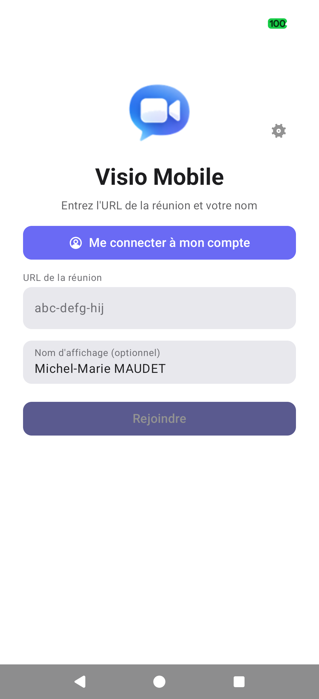
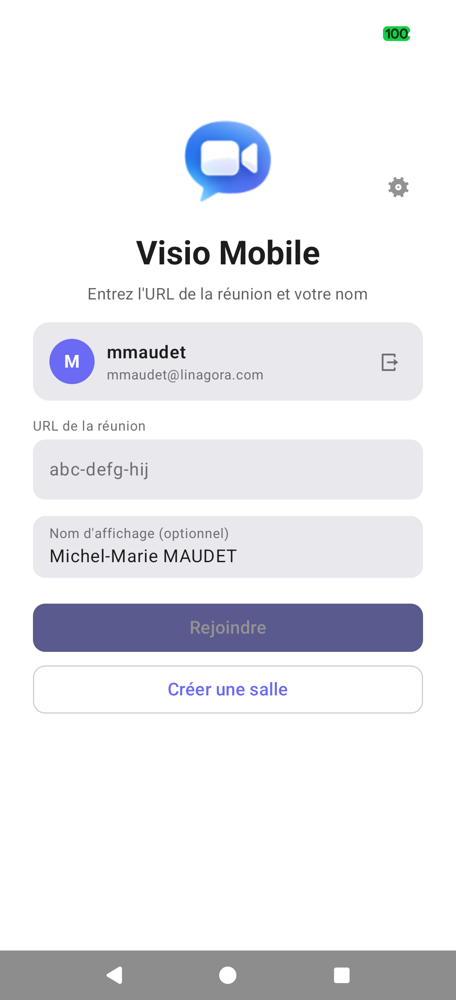
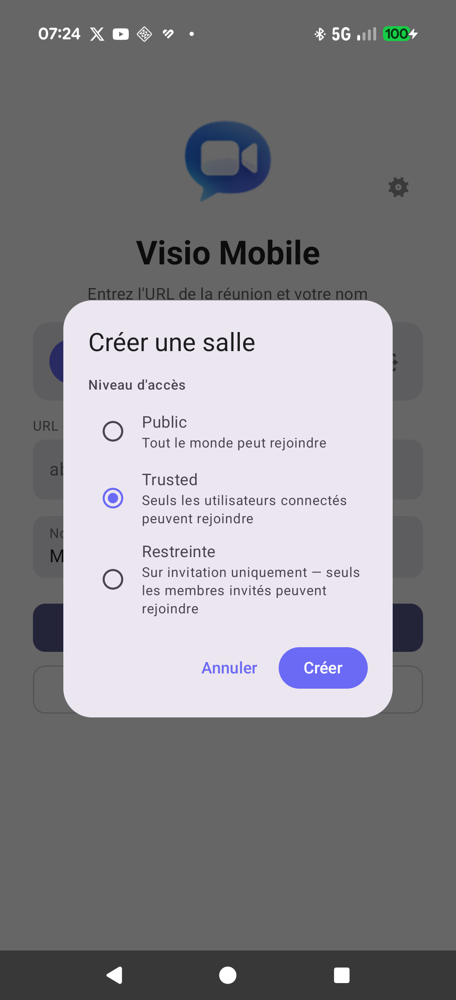
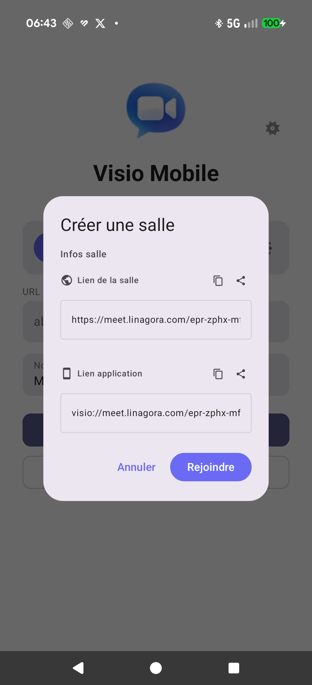
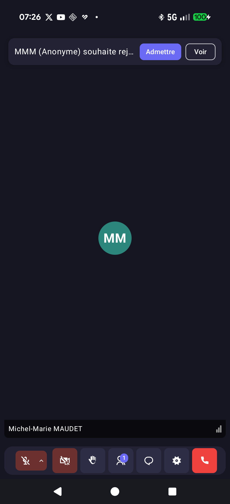
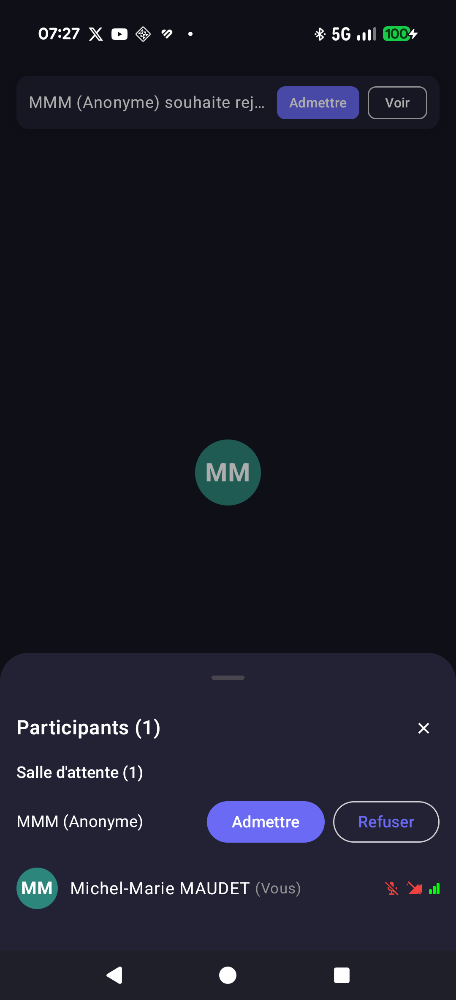

<p align="center">
  
</p>

# Visio Mobile

Native video conferencing client for [La Suite Meet](https://meet.numerique.gouv.fr) instance, built on the [LiveKit Rust SDK](https://github.com/livekit/rust-sdks).

> **Status: Beta — Active Development**
> Core functionality works end-to-end on all three platforms. The app is currently in closed beta testing on Android (Firebase App Distribution) and iOS (TestFlight).
>
> **Want to join the beta?** Contact [mmaudet@linagora.com](mailto:mmaudet@linagora.com) to be added as a tester on iOS and/or Android.

## Screenshots

<p align="center">
  
  &nbsp;&nbsp;&nbsp;&nbsp;
  
</p>
<p align="center">
  <em>Left: iOS — Home screen &nbsp;|&nbsp; Right: Android — Active video call</em>
</p>

## Authentication (OIDC / ProConnect)

Visio Mobile supports authentication via **OpenID Connect** (OIDC), compatible with ProConnect and any OIDC provider configured on the Meet server. Authentication is optional — anonymous users can still join public rooms via URL.

### How it works

<p align="center">
  
  &nbsp;
  
  &nbsp;
  
</p>

1. **Home screen** — The "Me connecter à mon compte" button starts the OIDC flow. The user enters a room URL and display name as usual.
2. **Authenticated state** — After login, the user's identity (name, email, avatar) is displayed. A logout button and a "Créer une salle" (Create a room) button appear.
3. **Room creation** — Authenticated users can create rooms directly from the app, choosing the access level: Public, Trusted, or Restricted.

<p align="center">
  
  &nbsp;
  
  &nbsp;
  
</p>

4. **Room info** — After creation, the room info displays the shareable web link and the `visio://` deep link with copy and share buttons.
5. **Lobby notification** — When a participant requests to join a trusted room, the host sees a persistent notification banner with "Admettre" (Admit) and "Voir" (View) buttons.
6. **Waiting room management** — The participants panel shows the waiting room section with admit/deny controls for each pending participant.

### Room access levels

| Level | Description | Authentication required |
|-------|-------------|------------------------|
| **Public** | Anyone with the link can join immediately | No |
| **Trusted** | Only authenticated users can join; anonymous users enter a waiting room where the host can admit or deny them | Host: Yes · Guests: No (waiting room) |
| **Restricted** | Invitation only — only users explicitly added as members by the room creator can join | Yes (all participants) |

**Server prerequisites for restricted rooms:** The Meet server must support the `/api/v1.0/rooms/<id>/accesses/` endpoint for managing room membership (available in La Suite Meet ≥ 1.7). Additionally, user search for invitations requires the server setting `ALLOW_UNSECURE_USER_LISTING=True` to expose the `/api/v1.0/users/` endpoint.

### Session management

- The OIDC session cookie is stored securely in the platform keychain (Android Keystore / iOS Keychain / Desktop OS credential store)
- Sessions persist across app restarts — no need to re-authenticate each time
- The OIDC flow uses an embedded `WKWebView` (iOS) / `WebView` (Android) with a non-persistent cookie jar to ensure clean login state

## Background blur and replacement

Visio Mobile includes on-device background processing powered by a **selfie segmentation AI model** (ONNX Runtime). All processing runs locally on the device — no frames are sent to any server.

Available modes:
- **Background blur** — Gaussian blur applied to the background while keeping the person in focus
- **Background replacement** — Replace the background with one of 8 built-in images

The feature uses the [MediaPipe Selfie Segmentation](https://ai.google.dev/edge/mediapipe/solutions/vision/image_segmenter) model converted to ONNX format, running inference at each camera frame through ONNX Runtime. Settings are accessible from the in-call settings panel on all three platforms.

## Animated reactions

Participants can send animated emoji reactions during a call. Reactions are transmitted in real time via LiveKit data channels and displayed as floating animations on all participants' screens. Available from the overflow menu in the call control bar.

## Adaptive context modes

Visio Mobile automatically adapts the meeting interface based on the user's physical context. The app detects three modes — **Office**, **Pedestrian**, and **Car** — and adjusts the UI, video layout, and audio routing accordingly.

### Modes

| Mode | Trigger | UI | Audio |
|------|---------|-----|-------|
| **Office** | Default (no motion, no car Bluetooth) | Full video grid, all controls visible | Phone speaker/mic or manual selection |
| **Pedestrian** | Walking/running detected via accelerometer (Android) or Core Motion (iOS) | Single active speaker tile, large buttons | Auto-routes to connected Bluetooth headset |
| **Car** | Bluetooth car kit or hands-free device detected | Audio-only view (no video), extra-large mic + hangup buttons | Auto-routes to car Bluetooth (mic + speaker) |

### How it works

1. **Context detection** runs in the background during a call, monitoring three signals:
   - **Motion** — Accelerometer deviation from gravity (Android, threshold: 2.5 m/s², 15s cooldown) or `CMMotionActivityManager` activity classification (iOS)
   - **Bluetooth** — Connected audio device type: car systems (HFP, car audio, or uncategorized devices like Tesla) trigger Car mode; headphones/earbuds do not
   - **Network** — WiFi vs cellular (stored for future adaptive quality)

2. **Mode priority**: Car (Bluetooth) > Pedestrian (motion) > Office (default)

3. **Audio auto-routing**:
   - When a Bluetooth audio device connects during a call, audio input and output are automatically routed to it
   - When a Bluetooth device disconnects, audio routes to the next available Bluetooth device, or falls back to phone speaker/mic
   - Uses `setCommunicationDevice()` (Android 12+) or `startBluetoothSco()` (older) / `AVAudioSession.setPreferredInput()` (iOS)

4. **Manual override**: The overflow menu ("...") allows forcing a specific mode. Auto-detection resumes when the override is cleared.

5. **Camera management**: Entering Car mode automatically disables the camera (saves battery). When leaving Car mode, the camera is restored to its previous state. A 5-second grace period after connection prevents race conditions with camera-on-join settings.

### Audio source selection

The audio device picker (chevron next to the mic button) is available in **all modes** — not just Office. In Pedestrian and Car modes, the chevron and buttons scale up for easier interaction while moving.

## Platforms

| Platform | UI toolkit | Min version |
|----------|-----------|-------------|
| **Android** | Kotlin + Jetpack Compose | SDK 26 (Android 8) |
| **iOS** | Swift + SwiftUI | iOS 16 |
| **Desktop** | Tauri 2.x + React | macOS 12 / Linux / Windows |

## Architecture

```
┌──────────────┐  ┌─────────────┐  ┌──────────────┐
│   Android    │  │     iOS     │  │   Desktop    │
│  Compose UI  │  │  SwiftUI    │  │ Tauri + React│
└──────┬───────┘  └──────┬──────┘  └──────┬───────┘
       │ UniFFI          │ UniFFI         │ Tauri cmds
       ▼                 ▼                ▼
┌──────────────────────────────────────────────────┐
│                  visio-ffi                       │
│        UniFFI bindings + C FFI (video/audio)     │
├──────────────────────────────────────────────────┤
│                  visio-core                      │
│   RoomManager · AuthService · ChatService        │
│   MeetingControls · ParticipantManager           │
│   HandRaiseManager · SettingsStore               │
│   LobbyService · AccessService · SessionManager  │
│   AdaptiveEngine (Office/Pedestrian/Car modes)   │
├──────────────────────────────────────────────────┤
│                  visio-video                     │
│   I420 renderer registry · platform renderers    │
├──────────────────────────────────────────────────┤
│            LiveKit Rust SDK (0.7.32)             │
└──────────────────────────────────────────────────┘
```

**4 Rust crates:**

- **`visio-core`** — Room lifecycle, auth (Meet API + OIDC session), chat (Stream API `lk.chat`), participants, media controls, hand raise (Meet interop), active speaker tracking, persistent settings, event system, lobby/waiting room, room access management, reactions, adaptive context engine
- **`visio-video`** — Video frame rendering: I420 decode, renderer registry, platform-specific renderers
- **`visio-ffi`** — UniFFI `.udl` bindings (control plane) + raw C FFI (video/audio zero-copy) + on-device background blur/replacement (ONNX Runtime selfie segmentation)
- **`visio-desktop`** — Tauri 2.x commands + cpal audio + AVFoundation camera capture (macOS)

**Key design decisions:**
- UniFFI for structured control plane (connect, toggle mic, send chat)
- Raw C FFI for video/audio (zero-copy I420 to native surfaces, PCM audio pull)
- No WebView for calls — fully native rendering on each platform
- Guest-first: no auth required, join via Meet URL
- Edge-first AI: background blur/replacement runs on-device via ONNX Runtime, no data leaves the device

## Prerequisites

- **Rust** nightly (edition 2024) — `rustup default nightly`
- Platform-specific requirements are listed in each build section below

## Building

### Desktop (macOS / Linux / Windows)

**Prerequisites:** Node.js 18+, Tauri CLI (`cargo install tauri-cli@^2`)

**Linux only:** Install system dependencies:
```bash
# Debian/Ubuntu
sudo apt-get install libgtk-3-dev libwebkit2gtk-4.1-dev librsvg2-dev libasound2-dev

# Fedora
sudo dnf install gtk3-devel webkit2gtk4.1-devel librsvg2-devel alsa-lib-devel
```

```bash
# Install frontend dependencies (first time only)
cd crates/visio-desktop/frontend && npm install

# Dev mode (Tauri auto-starts Vite via beforeDevCommand)
cd crates/visio-desktop && cargo tauri dev

# Production build
cd crates/visio-desktop && cargo tauri build
```

Tauri automatically runs `npm run dev` (dev mode) or `npm run build` (production) via its `beforeDevCommand`/`beforeBuildCommand` config. Make sure no other Vite instance (e.g. from a git worktree) is occupying port 5173.

### Android

**Prerequisites:** NDK 27+, SDK 26+, `cargo-ndk` (`cargo install cargo-ndk`), `rustup target add aarch64-linux-android`

```bash
# 1. Build Rust libraries for arm64
bash scripts/build-android.sh

# 2. Build APK (i18n JSON files are auto-copied to assets/ by Gradle)
cd android && ./gradlew assembleDebug

# 3. Install on device/emulator
adb install app/build/outputs/apk/debug/app-debug.apk
```

The Gradle `copyI18nAssets` task runs automatically before build, copying `i18n/*.json` into `src/main/assets/i18n/`.

### iOS

**Prerequisites:** Xcode 16+, `rustup target add aarch64-apple-ios aarch64-apple-ios-sim`

```bash
# 1. Build Rust libraries
bash scripts/build-ios.sh sim      # for simulator (aarch64-apple-ios-sim)
bash scripts/build-ios.sh device   # for physical device (aarch64-apple-ios)

# 2. Open and run in Xcode
open ios/VisioMobile.xcodeproj
```

The Xcode "Copy i18n JSON" build phase copies `i18n/*.json` into the app bundle automatically. Select your target device in Xcode and hit Run.

## Internationalization (i18n)

The app supports **6 languages**: English, French, German, Spanish, Italian, and Dutch.

Translations are stored as shared JSON files in the `i18n/` directory at the project root. Each platform loads these files at startup — there is a single source of truth for all strings across Desktop, Android, and iOS.

```
i18n/
  en.json    # English (reference — 169 keys)
  fr.json    # Français
  de.json    # Deutsch
  es.json    # Español
  it.json    # Italiano
  nl.json    # Nederlands
```

**Adding a new language:** Create a new `i18n/<code>.json` file with all 169 keys translated. Then add the language code to `SUPPORTED_LANGS` (Desktop `App.tsx`), `supportedLangs` (Android `Strings.kt`, iOS `Strings.swift`).

**Adding a new key:** Add the key to all 6 JSON files. Use `t("key")` (Desktop), `Strings.t("key", lang)` (Android/iOS) in the UI code.

**Platform integration:**
- **Desktop** — Static JSON imports in `App.tsx`, bundled by Vite at build time
- **Android** — Gradle `copyI18nAssets` task copies JSON to `assets/i18n/` before build, loaded via `Strings.init(context)` in `VisioApplication`
- **iOS** — Xcode "Copy i18n JSON" build phase copies JSON into the app bundle, loaded via `Strings.initialize()` in `VisioMobileApp.init()`

## Deep Links

The app registers the `visio://` URL scheme on all platforms. Tapping a `visio://` link opens the app with the room pre-filled on the home screen.

**Format:** `visio://host/slug` — for example: `visio://meet.numerique.gouv.fr/abc-defg-hij`

The host must match one of the configured Meet instances (managed in Settings). By default, `meet.numerique.gouv.fr` is pre-configured. Unknown hosts are rejected with an error message.

**Testing deep links:**
- **Android:** `adb shell am start -a android.intent.action.VIEW -d "visio://meet.numerique.gouv.fr/abc-defg-hij"`
- **iOS:** `xcrun simctl openurl booted "visio://meet.numerique.gouv.fr/abc-defg-hij"`
- **Desktop:** `open "visio://meet.numerique.gouv.fr/abc-defg-hij"` (macOS)

### Universal Links / App Links (optional, server-side)

For HTTPS links (e.g., `https://meet.numerique.gouv.fr/slug`) to open the app directly instead of the browser, the Meet server admin must host verification files:

**Android App Links** — create `https://meet.example.com/.well-known/assetlinks.json`:
```json
[{
  "relation": ["delegate_permission/common.handle_all_urls"],
  "target": {
    "namespace": "android_app",
    "package_name": "io.visio.mobile",
    "sha256_cert_fingerprints": ["<YOUR_APP_SHA256>"]
  }
}]
```

**iOS Universal Links** — create `https://meet.example.com/.well-known/apple-app-site-association`:
```json
{
  "applinks": {
    "apps": [],
    "details": [{
      "appID": "<TEAM_ID>.io.visio.mobile",
      "paths": ["/*"]
    }]
  }
}
```

These are not required for the `visio://` scheme to work — they enable the additional HTTPS link interception.

## Running tests

```bash
cargo test -p visio-core
```

## Project structure

```
i18n/               Shared translation JSON files (6 languages)
crates/
  visio-core/       Shared Rust core (room, auth, chat, controls, settings)
  visio-video/      Video rendering (I420, renderer registry)
  visio-ffi/        UniFFI bindings + C FFI (video/audio)
  visio-desktop/    Tauri app (commands, cpal audio, camera)
android/            Kotlin/Compose app
ios/                SwiftUI app
scripts/            Build scripts (Android NDK, iOS fat libs)
```

## What works

**Core:**
- Join a La Suite Meet room via URL (guest or authenticated)
- OIDC / ProConnect authentication with persistent session
- Room creation with 3 access levels: public, trusted, restricted
- Waiting room / lobby management for trusted rooms (admit/deny participants)
- Restricted room member management (invite by user search)
- Real-time room URL validation with debounce (checks Meet API before joining)
- Bidirectional audio (mic + speaker) on all platforms
- Bidirectional video (camera + remote video) on all platforms
- Chat (bidirectional with Meet via LiveKit Stream API `lk.chat` topic)
- Participant list with connection quality indicators
- Hand raise with Meet interop (uses `handRaisedAt` attribute, auto-lower after 3s speaking)
- On-device background blur and background replacement (ONNX Runtime selfie segmentation)
- Animated emoji reactions via LiveKit data channels
- Adaptive context modes: automatic Office/Pedestrian/Car detection with UI and audio adaptation
- Bluetooth audio auto-routing (headset, car kit) with smart fallback on disconnect
- Persistent settings (display name, language, theme, mic/camera on join)
- Deep links: `visio://host/slug` opens the app with room pre-filled (all platforms)
- Configurable Meet instances list in Settings
- i18n: 6 languages (EN, FR, DE, ES, IT, NL) with shared JSON files

**Desktop UX (Meet-inspired):**
- Dark/light theme toggle (Meet palette: `#161622` base)
- Remixicon icon set across all controls
- Grouped control bar: mic+chevron, cam+chevron, hand raise, chat, participants, tools, info, hangup
- Device picker popovers (mic/speaker/camera enumeration via WebRTC API)
- Adaptive video grid (1x1 to 3x3) + click-to-focus layout with filmstrip
- Participant tiles with initials avatar (deterministic color), active speaker glow, hand raise badge, connection quality bars
- Chat sidebar (358px, slide-in animation, own messages right-aligned in accent color)
- Participants sidebar with live count
- Info panel with meeting URL copy
- Settings modal (display name, language, theme, join preferences)

**Android UX (Meet-inspired):**
- Material 3 dark/light theme with Meet color palette (`#161622` base)
- Remixicon SVG vector drawables (14 icons)
- Grouped control bar: mic+audio picker, cam+switch, hand raise (yellow highlight), chat with unread badge (9+), hangup
- Audio device bottom sheet (speaker, earpiece, Bluetooth, USB headset, wired)
- Adaptive video grid (1x2, 2x2) + tap-to-focus layout with horizontal filmstrip
- Participant tiles with initials avatar (deterministic HSL color), active speaker glow, muted mic icon, hand raise badge with queue position, connection quality bars
- Chat with message bubbles, sender grouping, timestamps, send icon, unread tracking
- Participant list bottom sheet with live count
- Picture-in-Picture support (active speaker only, mute/hangup controls via BroadcastReceiver)
- Room URL validation with real-time status feedback (debounced Meet API check)
- Settings screen (display name, language, mic/camera on join)
- Edge-to-edge display support

**iOS UX (Meet-inspired):**
- Meet dark/light theme (VisioColors palette, Color hex init)
- SF Symbols for all control bar icons (native iOS feel)
- Grouped control bar: mic+audio route chevron, cam+switch, hand raise (yellow tint), chat with unread badge (9+), hangup
- Audio device sheet with AVAudioSession port enumeration (speaker, earpiece, Bluetooth)
- Adaptive video grid (LazyVGrid) + tap-to-focus layout with horizontal strip
- Participant tiles with initials avatar (deterministic hue), active speaker glow, muted indicator, hand raise pill with queue position, connection quality bars
- Chat view with message history, sender names, timestamps
- Participant list bottom sheet
- CallKit integration (system call UI, Dynamic Island, lock screen mute/hangup, phone call interruption auto-mute)
- Picture-in-Picture with AVPictureInPictureController + AVSampleBufferDisplayLayer (auto-start on background)
- Room URL validation with real-time debounced feedback
- Settings view (display name, language, mic/camera on join)

## Recent additions (v0.4.0)

- **OIDC / ProConnect authentication**: Full login flow with embedded WebView, session persistence in platform keychain, user profile display, and logout
- **Room creation**: Authenticated users can create rooms with public, trusted, or restricted access levels
- **Waiting room / lobby**: Host notification banner, participant admit/deny, waiting room section in participant list
- **Restricted rooms**: Invitation-only rooms with user search and member management
- **Background blur & replacement**: On-device AI-powered background processing using selfie segmentation (ONNX Runtime), with 8 built-in replacement images
- **Animated reactions**: Real-time emoji reactions via LiveKit data channels with floating animation overlay
- **Wake lock**: Screen stays on during active calls; audio continues when screen is manually turned off (Android partial wake lock, iOS idle timer disabled)
- **Independent audio routing**: Select input and output audio devices separately (e.g., Bluetooth mic + phone speaker)
- **In-call settings panel**: Tabbed bottom sheet for microphone/camera/notification/background settings during a call
- **Network resilience**: Automatic reconnection with UI banner (via LiveKit SDK)
- **Adaptive context modes**: Automatic Office/Pedestrian/Car detection with adapted UI, active speaker view in pedestrian mode, audio-only car mode, Bluetooth auto-routing, and manual override

## What's next

- Official App store packaging (APK/IPA/DMG)
- Live subtitles (on-device Whisper)
- Silent catch-up (join summary)
- Live subtitle translation (on-device NLLB)

## Configuration

The app connects to any La Suite Meet instance. By default, URLs point to placeholder values (`meet.example.com`). Update the Meet URL at runtime in the app's home screen.

## License

[AGPL-3.0](LICENSE)
